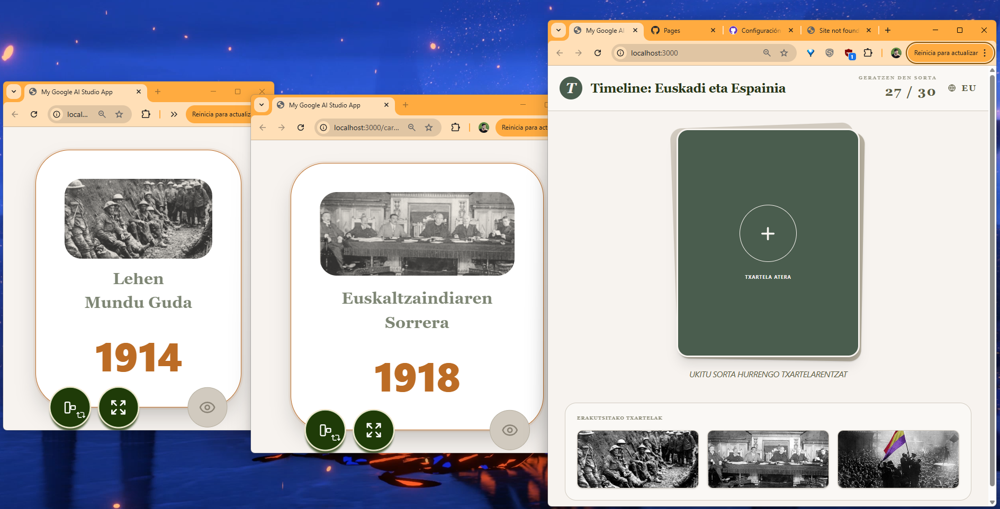

# Timeline: Euskadi y España / Euskadi eta Espainia

Juego de mesa virtual de tipo Timeline ambientado en la historia de Euskadi y España. Los jugadores roban cartas con eventos históricos y deben colocarlos en orden cronológico. Funciona completamente en el navegador, sin servidor ni base de datos.



---

## Características

- **30 cartas históricas** que abarcan desde el Paleolítico hasta 2018
- **Bilingüe** — interfaz y contenido de las cartas en castellano y euskera
- **Carta a pantalla completa** con animación de volteo 3D y modo apaisado/vertical
- **Estado persistente** en `localStorage` — las cartas reveladas se recuerdan entre sesiones
- **Diseño responsive** optimizado para móvil y tablet con `100dvh`
- **Modo pantalla completa** nativo del navegador

---

## Tecnologías

| Capa | Librería / Herramienta |
|---|---|
| UI | React 19 + TypeScript |
| Estilos | Tailwind CSS 4 |
| Animaciones | Framer Motion / motion |
| Iconos | Lucide React |
| Routing | React Router v7 |
| Build | Vite 6 |
| Contenedor | Docker + Docker Compose |

---

## Requisitos

- [Docker](https://docs.docker.com/get-docker/) y Docker Compose
- O Node.js 20+

---

## Desarrollo

### Con Docker (recomendado)

```bash
docker compose up -d --build
```

La aplicación estará disponible en [http://localhost:3000](http://localhost:3000).

Para ver los logs:

```bash
docker logs timeline-euskadi-dev -f
```

### Sin Docker

```bash
npm install
npm run dev
```

---

## Uso

1. Abre la aplicación en el navegador
2. Elige el idioma (ES / EU) desde la barra superior
3. Pulsa el mazo para robar una carta — se abre en una nueva ventana
4. La carta aparece en modo apaisado; pulsa el icono de orientación para cambiar a vertical
5. Pulsa el ojo para revelar la fecha
6. Las cartas ya reveladas quedan guardadas en el panel lateral
7. Pulsa **Reiniciar Mazo** cuando el mazo se agote para volver a empezar

---

## Rutas

| Ruta | Descripción |
|---|---|
| `/` | Página principal con el mazo y las cartas reveladas |
| `/card/:id` | Vista de carta en castellano |
| `/card/eu/:id` | Vista de carta en euskera |

---

## Estructura del proyecto

```
src/
├── App.tsx                  # Router principal con LanguageProvider
├── pages/
│   ├── Home.tsx             # Mazo y panel de cartas reveladas
│   └── CardView.tsx         # Vista de carta a pantalla completa
└── lib/
    ├── cards.ts             # Datos de las 30 cartas en castellano
    ├── cardsEu.ts           # Traducciones de las cartas al euskera
    ├── store.ts             # Estado del mazo en localStorage
    ├── languageContext.tsx  # Contexto de idioma y traducciones UI
    └── utils.ts             # Utilidades CSS
```

---

## Licencia

MIT
